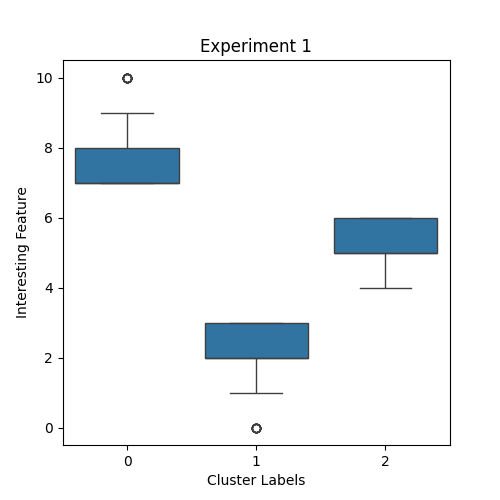
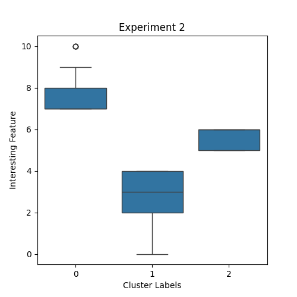
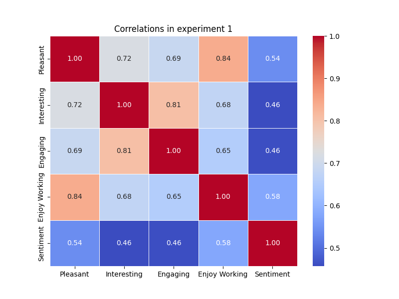
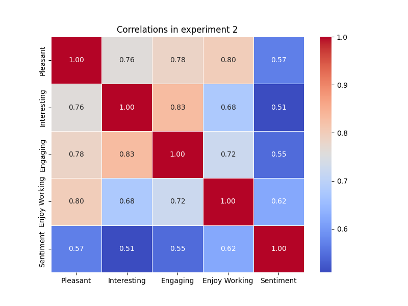

# EPFL ML_Course(CS-433) Project 2

## Introduction

Hello! Welcome to our team's repository of Project 2 of 2023 Machine learning course. 
In this project, we analyze the impressions of the view-out scenes based on multiple numerical ratings, as well as verbal descriptions.

## View Out Analysis Results Summary

This project investigates subjective impressions from different view-out experiences through two distinct experiments. Experiment 1 contrasts participant responses to static images and dynamic videos to understand the impact of movement on perception. Experiment 2 explores how clear and overcast sky conditions influence impressions of videos. Participants provided both numerical ratings and transcribed verbal descriptions for various scenes, allowing for a multifaceted analysis. Employing techniques like text clustering, topic extraction, sentiment analysis, and regression, this project aims to uncover patterns within both the textual and numerical data. Here are the main results and findings from our study:

# Exploratory Analysis
We extracted the top 10 most frequent words for each scene, revealing significant details about the participants' perceptions, notably their responses to colors and the environment's layout. We discovered that the participants often responded to color, with the reconstructed responses mentioning the adjectives “colorful”, “gray”, “green”, “red”, and “dark”, and even pointing to the
location of the colorful object, mentioning “left” or “right”. As an example, the we demonstrate the most frequent words for the two investigated scenes.


Figure 1. Top 10 most frequent words: like nice mountains view building buildings colors trees lot left.


Figure 2. Top 10 most frequent words: like nice building mountains colors buildings view right lot looks.

<!-- In order to get a representative summary of the participants’ responses, we extracted
the top 10 most salient words from texts within each scene number and scene type. To do that, we first vectorized the text using term frequency inverse document frequency (TF IDF) vectorizer, and then obtained the most frequent words with the non-negative matrix factorization (NMF [4]) with 1 topic. The top 10 resulting words were then compared with the contents of the displayed scene. Finally, we investigated how the subjective impressions from the participants match the textual description of the scenes produced by a computer vision model -->


# Clustering
Employing KMeans clustering based on individual numerical ratings of the viewed scene, we found non-overlapping clusters when using the interest rating.




Figure 3. K means clustering by the value of interest rating in experiments 1 and 2

Further, we investigated whether the identified clusters have a statistically significant difference in the frequency of the scene number and scene type. For that, we applied Chi-Square test on the contingency table containing the frequency of the observed scene number (or type) per each cluster. In both experiments, the results showed differences in scene number based only on the interesting rating.

Statistical Analysis
Correlation analysis highlighted strong relationships between ratings of ’Pleasant’, ’Interesting’, ’Engaging’, and ’Enjoy Working’. Linear regression models demonstrated predictability in pleasantness based on these factors, with
a significant proportion of variability in pleasant ratings explained by the models. Nested model selection showed that for both experiments, adding the features ”Engaging”, and ”Enjoy Working” produced a significantly better linear model, highlighting the strength of the relationship between those features and the feature ”Pleasant”.




Figure 4. Correlations among the numerical ratings in experiments 1 and 2

In a similar fashion, we found some weak correlations between the numerical features and the sentiment of the text
description. We then used nested model selection, which found that adding any of the ”Pleasant”, ”Enjoy Working”, or ”Engaging” features to the linear regression led to a statistically significant improvement to its performance. Based on this information, we devised a logistic regression based on these relevant features, which performed well [tab. II]. Further, we evaluated the random
forest model with 100 estimators and maximum tree depth at 2, which showed an average accuracy and F1
score of 0.82 and 0.85 [tab. I], respectively. This choice of hyper parameters of the random forest allows us to limit overfitting, since we were only working with a small training dataset of 671 points, each with 3 numerical features to feed to the decision tree. Interestingly, the average F1 score and accuracy of the random forest are identical to those of the
logistic regression. These results could be due to the fact that our data is mostly linearly separable. Further, since our
dataset is not very large or complex, it is possible that it cannot differentiate between the simpler logistic regression
and the more complex random forest. As expected, both the random forest and the logistic regression outperformed the random classifier as well as the majority class baseline [tab. III, IV].

**Table I: Random Forest trained to predict sentiment-score based on the numerical features.**

|           | Experiment 1 | Experiment 2 | Average |
|-----------|--------------|--------------|---------|
| Accuracy  | 0.83         | 0.81         | 0.82    |
| F1-score  | 0.85         | 0.85         | 0.85    |

**Table II: Logistic regression.**

|           | Experiment 1 | Experiment 2 | Average |
|-----------|--------------|--------------|---------|
| Accuracy  | 0.83         | 0.80         | 0.82    |
| F1-score  | 0.86         | 0.84         | 0.85    |

**Table III: Random Classifier**

|           | Experiment 1 | Experiment 2 | Average |
|-----------|--------------|--------------|---------|
| Accuracy  | 0.51         | 0.57         | 0.54    |
| F1-score  | 0.55         | 0.62         | 0.59    |

**Table IV: Majority class baseline**

|           | Experiment 1 | Experiment 2 | Average |
|-----------|--------------|--------------|---------|
| Accuracy  | 0.60         | 0.60         | 0.60    |
| F1-score  | 0.45         | 0.45         | 0.45    |


# Conclusion
Our study provides insights into the subjective view-out impressions, highlighting the impact of dynamic elements and environmental conditions on individual perceptions. The consistent trends identified across the two experiments underscore the importance of movement and ambiance in shaping the view-out experiences. Our findings offer crucial implications for environmental and architectural design, providing detailed insights and nuances on the participants' views-out impressions. Namely, we found that dynamic views with large open spaces were especially well-rated. Future research could explore these aspects further, contributing to the design of more engaging and pleasant environments.

## Project Structure
In this repository, you will find relevant files:
1. Dataset.zip - this file contains the .CSV data with the responses from the study participants
2. data_analysis.ipynb - here you will find the bulk of our computations, including the predictive models, clustering, and natural language processing
3. sessions_comparisson.ipynb - this file contains t-tests comparing 2 experimental sessions
4. sessions_scene_description.ipynb - here we implement code for grouping text based on relevant categories as well as extracting top 10 words
5. requirements.txt - this is the list of dependencies which should be installed with pip
6. gpt_exp1_scenes.txt - here we record the GPT4-generated descriptions of the scene data

### Environment

To run the code in this repository, you will need to first set up python virtual environment with the following commands:

```
python -m venv .venv
source ./.venv/bin/activate
pip install -r requirements.txt
```

Next, 

## Usage
In order to successfully run the code in this repository, you will need to complete the following steps:

1. Clone the repository into your local machine
2. In the root folder of the repository, unzip the Dataset.zip file
2. After activating the environment and installing the dependencies, you can connect to the Jupyter Kernel and run the provided .ipynb notebooks
